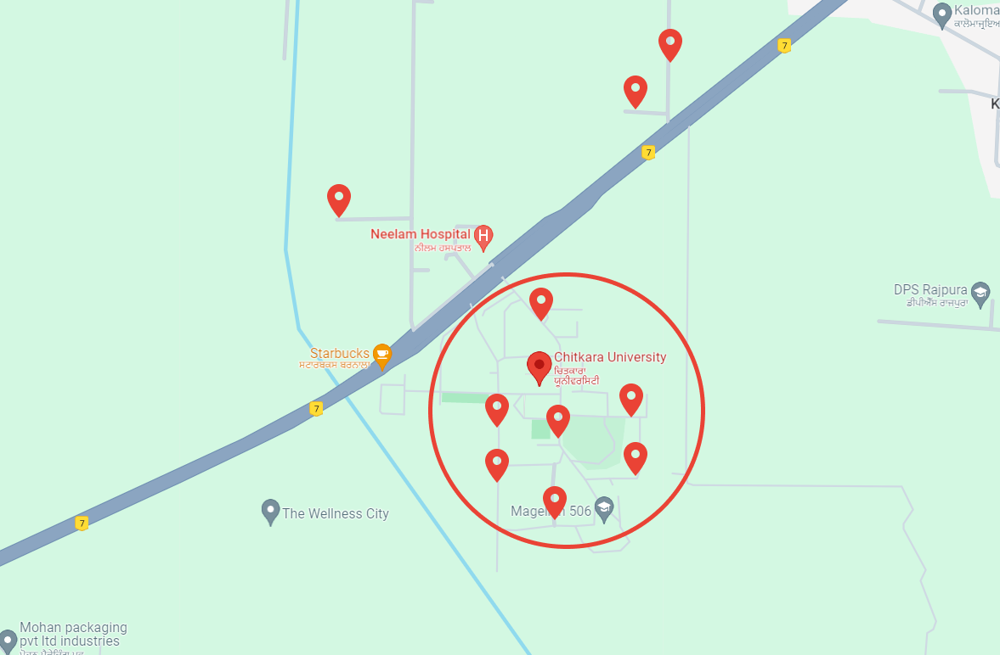

# Sahayak

## Inspiration

In our day to day lives we face several problems in our daily lives, such as water shortage, electricity issues, potholes on roads and so on. To solve these issues we often find ourselves in the department offices lodging requests which consumes a lot of our time. If we try to lodge the issue from the comfort of our homes via calls, often we find the numbers outdated on websites and we find our requests lost and untracked.

To resolve this issue we came up with a centralized platform **"Sahayak"** where a user can lodge all their issues, targeting specific departments. In turn, departments can also keep track of the issues and view the data graphically. Departments can also view issues on a map view getting an estimate of the situation and the number of people involved.

### TLDR;

- We try to act as an intermediatory link between Department Officials and Citizens(you).
- Users can lodge issues(eg below), and departments can view issues on an map view.
- Any issue lodged is for the selected department only, and a proper track of the status is maintained.

## What it does

- Our App reduces the communication gap between the citizens and the government departments.
- It provides a platform where users can **add issues**(with images) for a department from their exact location. Unlike offline transactions, the complete life of an issue is tracked.
- Departments can view the issues raised in their department in a **map view**, making it easy to visualize and allocate resources accordingly.
  
- Even if the department marks an issue as solved, the user gets a notification to confirm if the issue was really resolved.
- Our App, also resolves the issue of **outdated numbers**, as departments can view and update their numbers through the app itself.
- There might be some issues which the government might be aware of in advance and would want to inform the people of that region, they can do it through the **announcements page** in our application.

## How we built it?

- Design: Figma
- Frontend: Flutter
- Backend: NodeJS~Express + FirebaseAuth
- Database: MongoDBAtlas

## Challenges we faced

Here are the few of issues we faced while developing **Saksham** mobile application:

- While showing issues on map we can't show two markers at the same place, thus we need to block the user to one issue per department. To counter this, firstly we implemented the deletion of the issues after some specific time period(36 hours), we tried to do it via TTL in MongoDBAtlas, but we also needed the data for future reference and issue tracking. Later, we decided to prompt the user if an issue was open in the department already. User, could then mark the old issue as stale and then add the new issue.

- One issue we faced was while setting up MongoDBAtlas, took some time to get familiar with the user interface. But as we started working with it, we were comfortable with it. We already had some experience with MongoDB and the working was essentially the same.

## What we learned

- How to create custom backend and communicate between app & backend.
- How to use custom marker pins in Google Maps in Flutter.
- MongoDBAtlas TTL Index (used to expire data in specified amount of seconds).
- Sorting & Selecting data with mongoose and MongoDBAtlas.
- Learned basics of Taipy and built a basic website(not included in repo).

 
